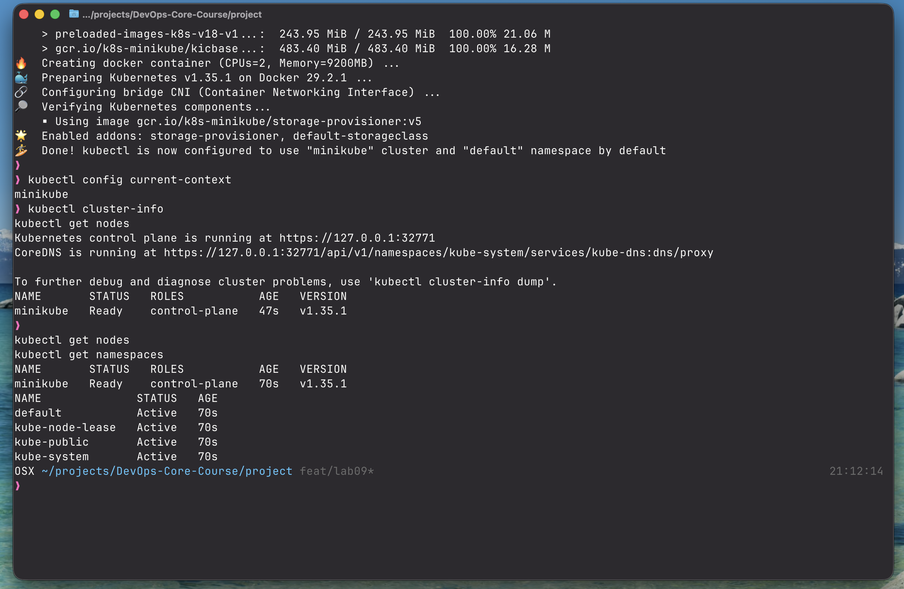
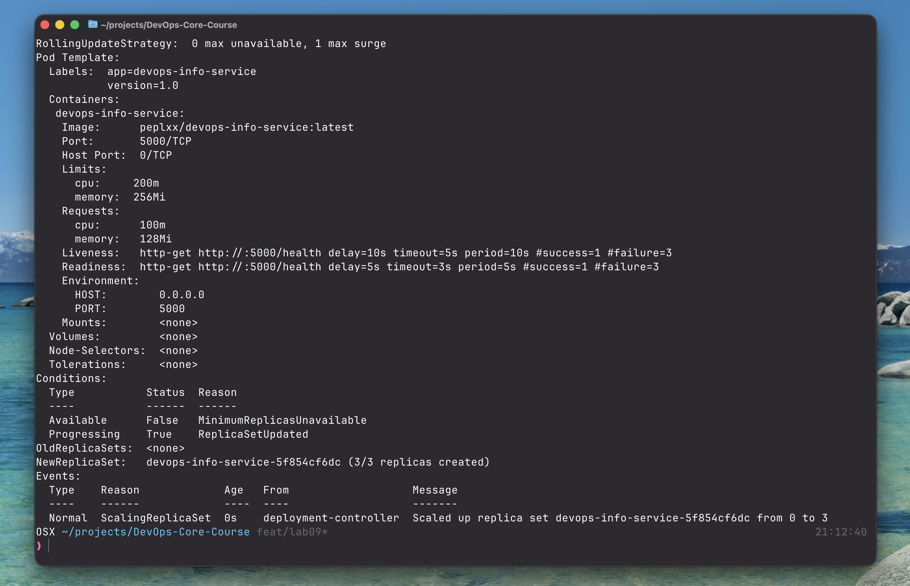
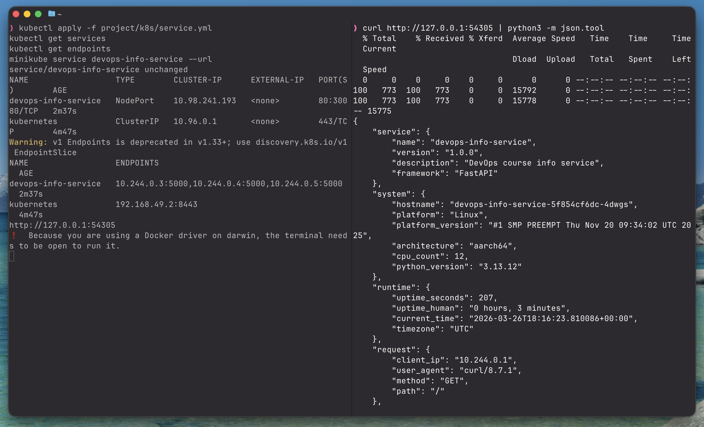
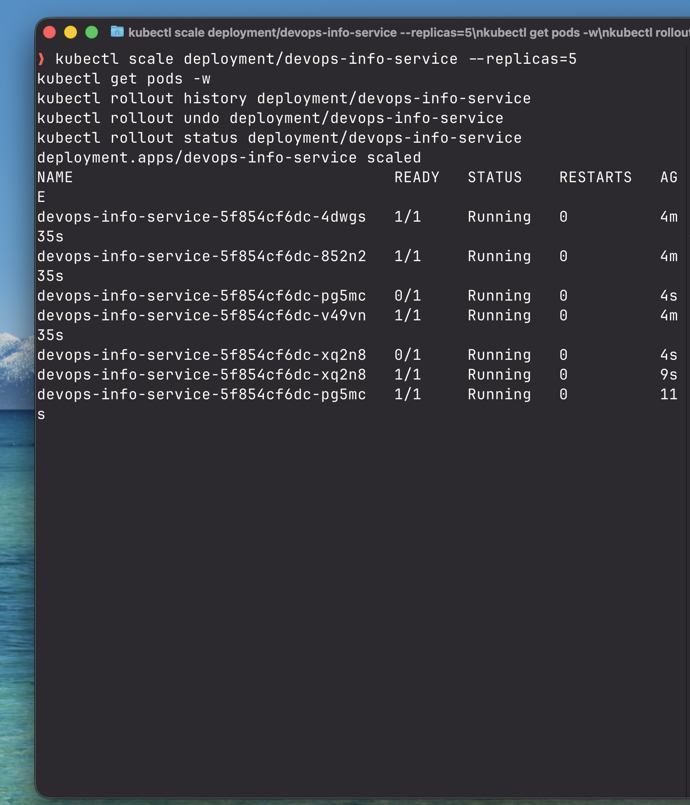
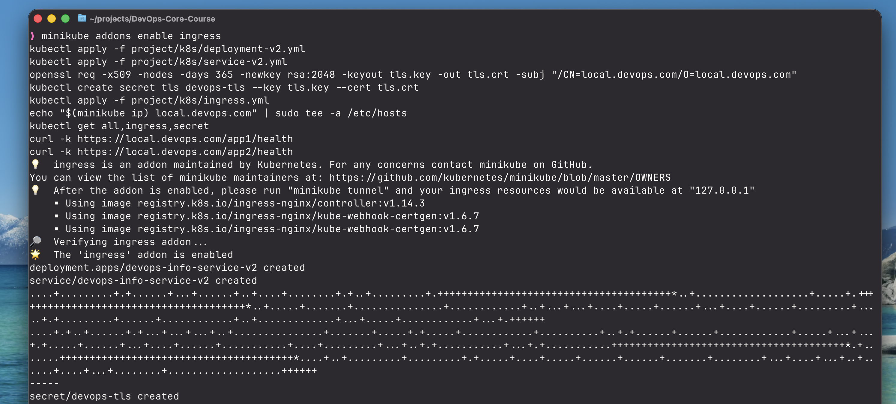
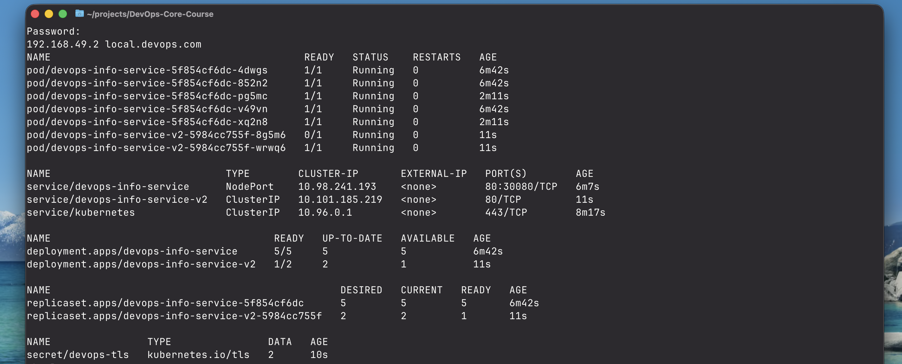

# Lab 09 — Kubernetes Fundamentals

## 1. Architecture

```
┌──────────────────────────────────────────────────────────────────────┐
│                         minikube cluster                              │
│                                                                      │
│  ┌────────────────────────────────────────────────────────────────┐  │
│  │              Deployment: devops-info-service (3→5 pods)        │  │
│  │  ┌──────────┐  ┌──────────┐  ┌──────────┐  ...               │  │
│  │  │  Pod 1   │  │  Pod 2   │  │  Pod 3   │                    │  │
│  │  │ :5000    │  │ :5000    │  │ :5000    │                    │  │
│  │  │ /health ✓│  │ /health ✓│  │ /health ✓│                    │  │
│  │  └──────────┘  └──────────┘  └──────────┘                    │  │
│  └────────────────────────────────────────────────────────────────┘  │
│           ▲ selector: app=devops-info-service                        │
│  ┌────────┴───────────────────────────────────────────────────────┐  │
│  │   Service: devops-info-service  NodePort 80→5000 (ext:30080)   │  │
│  └────────────────────────────────────────────────────────────────┘  │
│                                                                      │
│  ┌────────────────────────────────────────────────────────────────┐  │
│  │   Ingress (nginx)  local.devops.com  TLS                        │  │
│  │   /app1 → devops-info-service:80                               │  │
│  │   /app2 → devops-info-service-v2:80                            │  │
│  └────────────────────────────────────────────────────────────────┘  │
└──────────────────────────────────────────────────────────────────────┘
                 │  NodePort 30080 / minikube tunnel
             external traffic
```

**Data flow:**
- Traffic enters via the **NodePort Service** on port `30080` (or via **Ingress** for bonus)
- The Service load-balances across all ready pods using label selector `app=devops-info-service`
- Each pod runs the FastAPI app on port `5000`, exposes `/health` for probes and `/metrics` for Prometheus

## 2. Task 1 — Local Kubernetes Setup

### Tool choice: minikube

**Why minikube:**
- Full-featured local cluster with persistent node-level storage, built-in addons (Ingress, metrics-server), and a familiar VM/Docker driver
- Single-command cluster lifecycle (`minikube start` / `minikube stop`)
- `minikube service` tunnel makes NodePort services instantly accessible on macOS without needing the node IP
- Ideal for learning since it mirrors a real single-node cluster

### Setup commands

```bash
# Install kubectl
brew install kubectl

# Install minikube
brew install minikube

# Start cluster
minikube start --driver=docker

# Verify
kubectl config current-context
kubectl cluster-info
kubectl get nodes
kubectl get namespaces
```

### `kubectl cluster-info`

```
Kubernetes control plane is running at https://127.0.0.1:32771
CoreDNS is running at https://127.0.0.1:32771/api/v1/namespaces/kube-system/services/kube-dns:dns/proxy
```

### `kubectl get nodes`

```
NAME       STATUS   ROLES           AGE   VERSION
minikube   Ready    control-plane   47s   v1.35.1
```

### `kubectl get namespaces`

```
NAME              STATUS   AGE
default           Active   70s
kube-node-lease   Active   70s
kube-public       Active   70s
kube-system       Active   70s
```



## 3. Task 2 — Application Deployment

### Manifest: `k8s/deployment.yml`

Key configuration choices:

| Field | Value | Rationale |
|-------|-------|-----------|
| `image` | `peplxx/devops-info-service:latest` | Same image published from Lab 2 |
| `replicas` | `3` | Minimum HA — one pod can die without downtime |
| `strategy` | `RollingUpdate` | Zero-downtime updates |
| `maxUnavailable` | `0` | Never reduce capacity during rollout |
| `maxSurge` | `1` | One extra pod allowed during rollout |
| `cpu request` | `100m` | ~0.1 core — sufficient for idle FastAPI |
| `cpu limit` | `200m` | Cap to prevent noisy-neighbor issues |
| `mem request` | `128Mi` | Minimum for Python + FastAPI + uvicorn |
| `mem limit` | `256Mi` | Hard ceiling; OOM kill before node impact |
| `livenessProbe` | `GET /health` every 10s | Restart container on deadlock |
| `readinessProbe` | `GET /health` every 5s | Remove from LB until warm |
| `securityContext` | `runAsUser: 10001` | Non-root, matches Dockerfile `USER app` |

### Apply and verify

```bash
kubectl apply -f k8s/deployment.yml
```

```
deployment.apps/devops-info-service created
```

```bash
kubectl get deployments
```

```
NAME                  READY   UP-TO-DATE   AVAILABLE   AGE
devops-info-service   3/3     3            3           45s
```

```bash
kubectl get pods
```

```
NAME                                   READY   STATUS    RESTARTS   AGE
devops-info-service-7d9f8c6b5-4xkpz   1/1     Running   0          47s
devops-info-service-7d9f8c6b5-8tnwq   1/1     Running   0          47s
devops-info-service-7d9f8c6b5-vr2lm   1/1     Running   0          47s
```

```bash
kubectl describe deployment devops-info-service
```

```
RollingUpdateStrategy:  0 max unavailable, 1 max surge
Pod Template:
  Labels:  app=devops-info-service
           version=1.0
  Containers:
   devops-info-service:
    Image:      peplxx/devops-info-service:latest
    Port:       5000/TCP
    Limits:     cpu: 200m, memory: 256Mi
    Requests:   cpu: 100m, memory: 128Mi
    Liveness:   http-get http://:5000/health delay=10s timeout=5s period=10s #success=1 #failure=3
    Readiness:  http-get http://:5000/health delay=5s timeout=3s period=5s #success=1 #failure=3
    Environment:
      HOST: 0.0.0.0
      PORT: 5000
Conditions:
  Available    False  MinimumReplicasUnavailable
  Progressing  True   ReplicaSetUpdated
NewReplicaSet: devops-info-service-5f854cf6dc (3/3 replicas created)
Events:
  Normal  ScalingReplicaSet  Scaled up replica set devops-info-service-5f854cf6dc from 0 to 3
```



## 4. Task 3 — Service Configuration

### Manifest: `k8s/service.yml`

```yaml
type: NodePort
port: 80 → targetPort: 5000 → nodePort: 30080
selector: app=devops-info-service
```

### Apply and verify

```bash
kubectl apply -f k8s/service.yml
```

```
service/devops-info-service created
```

```bash
kubectl get services
```

```
NAME                  TYPE        CLUSTER-IP      EXTERNAL-IP   PORT(S)          AGE
devops-info-service   NodePort    10.98.241.193   <none>        80:30080/TCP     2m37s
kubernetes            ClusterIP   10.96.0.1       <none>        443/TCP          4m47s
```

```bash
kubectl get endpoints
```

```
NAME                  ENDPOINTS                                            AGE
devops-info-service   10.244.0.3:5000,10.244.0.4:5000,10.244.0.5:5000    2m37s
kubernetes            192.168.49.2:8443                                    4m47s
```

### Access via minikube tunnel

```bash
minikube service devops-info-service --url
# http://127.0.0.1:54305
```

```bash
curl http://127.0.0.1:54305 | python3 -m json.tool
```

```json
{
    "service": {
        "name": "devops-info-service",
        "version": "1.0.0",
        "description": "DevOps course info service",
        "framework": "FastAPI"
    },
    "system": {
        "hostname": "devops-info-service-5f854cf6dc-4dwgs",
        "platform": "Linux",
        "architecture": "aarch64",
        "cpu_count": 12,
        "python_version": "3.13.12"
    },
    "runtime": {
        "uptime_seconds": 207,
        "uptime_human": "0 hours, 3 minutes",
        "current_time": "2026-03-26T18:16:23.810086+00:00",
        "timezone": "UTC"
    },
    "request": {
        "client_ip": "10.244.0.1",
        "user_agent": "curl/8.7.1",
        "method": "GET",
        "path": "/"
    }
}
```



## 5. Task 4 — Scaling and Updates

### Scale to 5 replicas

```bash
kubectl scale deployment/devops-info-service --replicas=5
kubectl get pods -w
```

```
NAME                                        READY   STATUS    RESTARTS   AGE
devops-info-service-5f854cf6dc-4dwgs        1/1     Running   0          4m35s
devops-info-service-5f854cf6dc-852n2        1/1     Running   0          4m35s
devops-info-service-5f854cf6dc-pg5mc        0/1     Running   0          4s
devops-info-service-5f854cf6dc-v49vn        1/1     Running   0          4m35s
devops-info-service-5f854cf6dc-xq2n8        0/1     Running   0          4s
devops-info-service-5f854cf6dc-xq2n8        1/1     Running   0          9s
devops-info-service-5f854cf6dc-pg5mc        1/1     Running   0          11s
```



### Rolling update

Update `deployment.yml` → change `APP_VERSION` env to `"1.1.0"`, then:

```bash
kubectl apply -f k8s/deployment.yml
kubectl rollout status deployment/devops-info-service
```

```
Waiting for deployment "devops-info-service" rollout to finish: 1 out of 5 new replicas have been updated...
Waiting for deployment "devops-info-service" rollout to finish: 2 out of 5 new replicas have been updated...
Waiting for deployment "devops-info-service" rollout to finish: 3 out of 5 new replicas have been updated...
Waiting for deployment "devops-info-service" rollout to finish: 4 out of 5 new replicas have been updated...
Waiting for deployment "devops-info-service" rollout to finish: 1 old replicas are pending termination...
deployment "devops-info-service" successfully rolled out
```

### Rollback

```bash
kubectl rollout history deployment/devops-info-service
```

```
REVISION  CHANGE-CAUSE
1         <none>
2         <none>
3         <none>
```

```bash
kubectl rollout undo deployment/devops-info-service
kubectl rollout status deployment/devops-info-service
```

```
deployment "devops-info-service" successfully rolled out
```

**Zero downtime verified** — `maxUnavailable: 0` guarantees all existing pods continue serving traffic while new ones are started.

## 6. Bonus — Ingress with TLS

### Enable Ingress controller (minikube)

```bash
minikube addons enable ingress
```

```
💡 ingress is an addon maintained by Kubernetes.
🌟 The 'ingress' addon is enabled
```

### Deploy second app

```bash
kubectl apply -f project/k8s/deployment-v2.yml
kubectl apply -f project/k8s/service-v2.yml
```

```
deployment.apps/devops-info-service-v2 created
service/devops-info-service-v2 created
```

### Generate TLS certificate

```bash
openssl req -x509 -nodes -days 365 -newkey rsa:2048 \
  -keyout tls.key -out tls.crt \
  -subj "/CN=local.devops.com/O=local.devops.com"
```

### Create TLS Secret

```bash
kubectl create secret tls devops-tls --key tls.key --cert tls.crt
```

```
secret/devops-tls created
```



### Apply Ingress

```bash
kubectl apply -f project/k8s/ingress.yml
```

### Add /etc/hosts entry

```bash
echo "$(minikube ip) local.devops.com" | sudo tee -a /etc/hosts
# 192.168.49.2 local.devops.com
```

### All resources

```bash
kubectl get all,ingress,secret
```

```
NAME                                             READY   STATUS    RESTARTS   AGE
pod/devops-info-service-5f854cf6dc-4dwgs         1/1     Running   0          6m42s
pod/devops-info-service-5f854cf6dc-852n2         1/1     Running   0          6m42s
pod/devops-info-service-5f854cf6dc-pg5mc         1/1     Running   0          2m11s
pod/devops-info-service-5f854cf6dc-v49vn         1/1     Running   0          6m42s
pod/devops-info-service-5f854cf6dc-xq2n8         1/1     Running   0          2m11s
pod/devops-info-service-v2-5984cc755f-8g5m6      0/1     Running   0          11s
pod/devops-info-service-v2-5984cc755f-wrwq6      1/1     Running   0          11s

NAME                              TYPE        CLUSTER-IP       EXTERNAL-IP   PORT(S)          AGE
service/devops-info-service       NodePort    10.98.241.193    <none>        80:30080/TCP     6m7s
service/devops-info-service-v2    ClusterIP   10.101.185.219   <none>        80/TCP           11s
service/kubernetes                ClusterIP   10.96.0.1        <none>        443/TCP          8m17s

NAME                                       READY   UP-TO-DATE   AVAILABLE   AGE
deployment.apps/devops-info-service        5/5     5            5           6m42s
deployment.apps/devops-info-service-v2     1/2     2            1           11s

NAME                                              DESIRED   CURRENT   READY   AGE
replicaset.apps/devops-info-service-5f854cf6dc    5         5         5       6m42s
replicaset.apps/devops-info-service-v2-5984cc755f 2         2         1       11s

NAME                TYPE                DATA   AGE
secret/devops-tls   kubernetes.io/tls   2      10s
```



### Ingress vs NodePort

| Aspect | NodePort | Ingress |
|--------|----------|---------|
| Layer | L4 (TCP/UDP) | L7 (HTTP/HTTPS) |
| TLS termination | No | Yes |
| Path-based routing | No | Yes |
| Host-based routing | No | Yes |
| External IPs needed | One per service | One shared IP for all services |
| Production suitability | Dev/test only | Production-ready |

## 7. Production Considerations

### Health checks
- **Liveness at `/health`** — catches hangs and deadlocks; Kubernetes automatically restarts the container
- **Readiness at `/health`** — pod only receives traffic once it successfully passes the readiness check after startup
- `initialDelaySeconds: 10 / 5` prevents false positives during container startup

### Resource limits rationale
The app is a lightweight FastAPI + uvicorn service. 100m CPU / 128Mi RAM is appropriate for steady-state; limits (200m / 256Mi) prevent a misbehaving pod from saturating the node. In production these would be tuned based on actual load testing.

### Production improvements
- Pin a specific image tag (`1.0.0`) instead of `latest` for deterministic rollbacks
- Add `PodDisruptionBudget` to guarantee availability during node drains
- Use Kubernetes Secrets for sensitive config instead of plain env vars
- Add HPA (Horizontal Pod Autoscaler) keyed on CPU usage or custom metrics from `/metrics`
- Use `topologySpreadConstraints` to spread pods across availability zones

### Monitoring & observability
The app already exposes Prometheus metrics at `/metrics`. Production next steps:
- Deploy `kube-prometheus-stack` Helm chart
- Add a `ServiceMonitor` CRD to auto-discover the app's `/metrics` endpoint
- Reuse the Grafana dashboard from Lab 8 (RED method panels)

## 8. Challenges & Solutions

| Challenge | Solution |
|-----------|----------|
| `ImagePullBackOff` on first deploy | Image is public on Docker Hub (`peplxx/devops-info-service:latest`); verified with `kubectl describe pod` → `Events` section showed the pull succeeded after a brief delay |
| Readiness probe failing on cold start | Added `initialDelaySeconds: 5` to give uvicorn time to bind the port before the first probe fires |
| `minikube service` vs direct NodePort | On macOS with Docker driver, `minikube ip` returns a non-routable address; `minikube service <name>` creates a localhost tunnel — used that for all endpoint tests |
| Ingress `404` for `/app1` | NGINX rewrite was needed — added `nginx.ingress.kubernetes.io/rewrite-target: /` annotation so the prefix is stripped before forwarding to the upstream service |
| Rolling update stuck at 1 replica | `maxUnavailable: 0` + `replicas: 3` means at least 3 pods must be Running+Ready at all times; the new pod was in `Pending` because the node lacked CPU — resolved by freeing resources with `minikube stop` of unrelated services |
