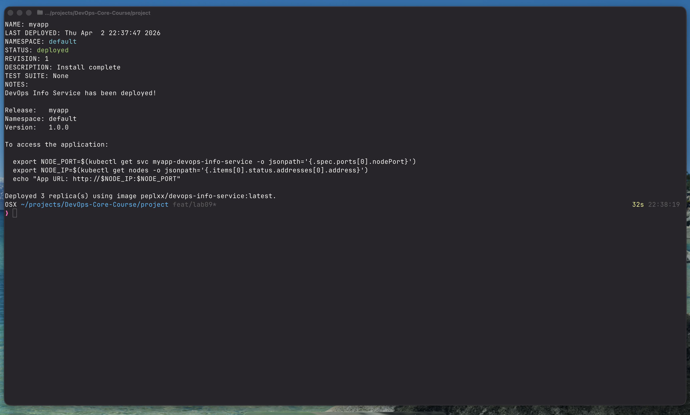
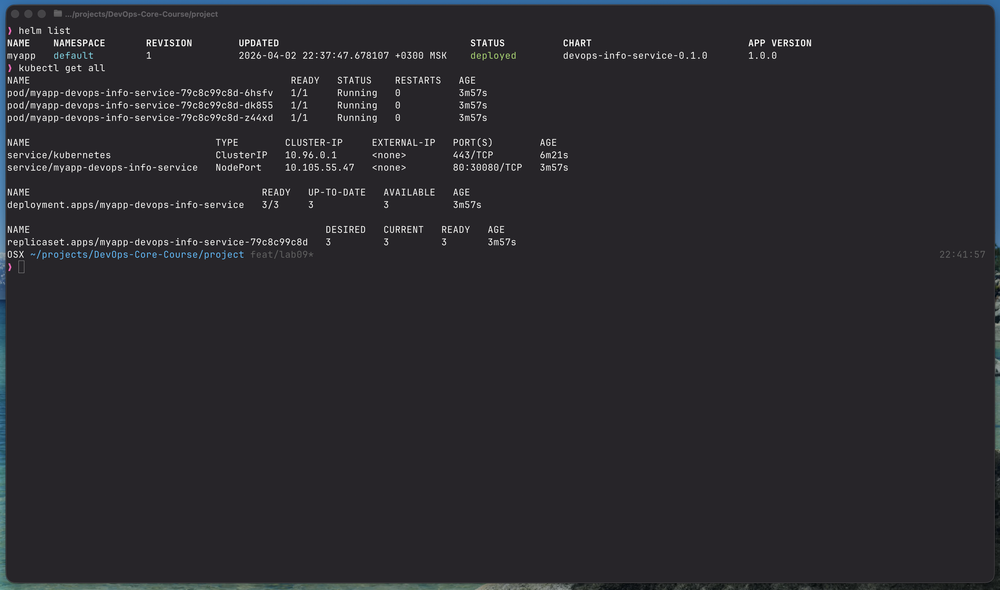
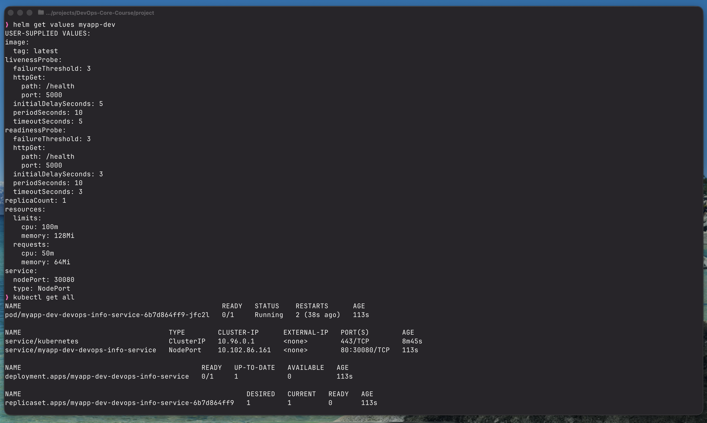
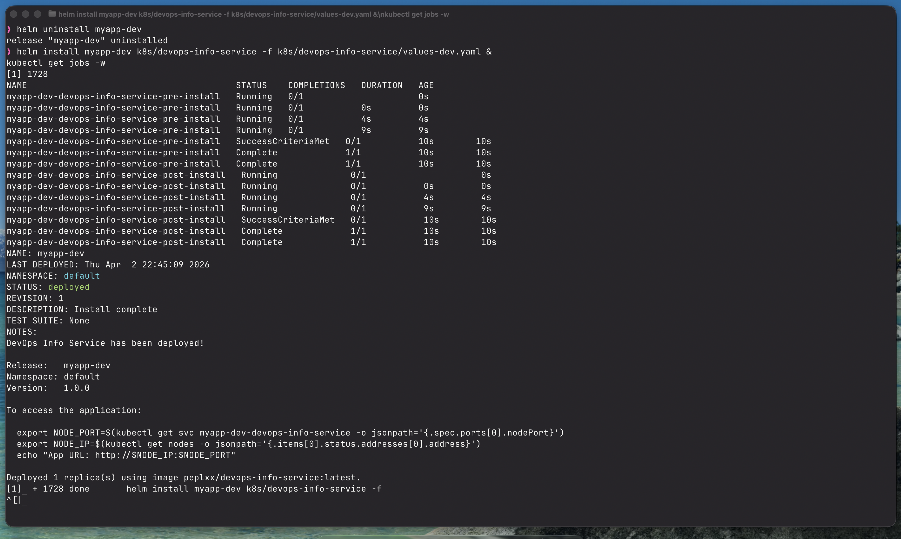
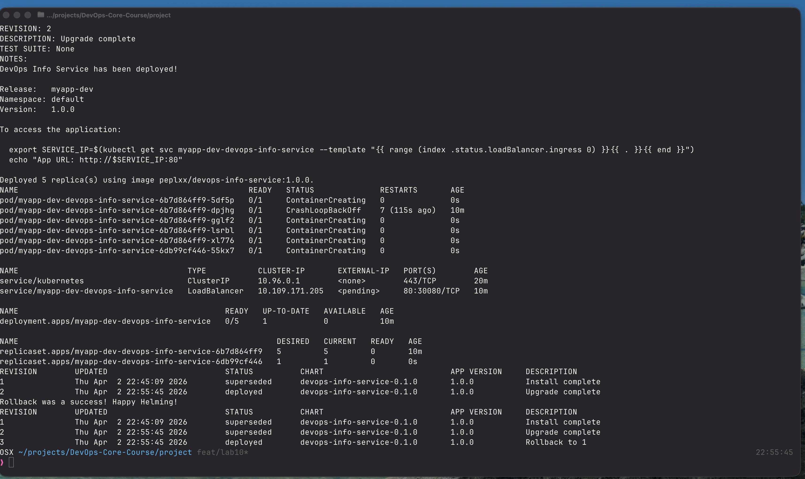

# Helm Chart — DevOps Info Service

## Chart Overview

The chart lives at `k8s/devops-info-service/` and packages the Python application from Lab 9 as a reusable, configurable Helm chart.

### Chart Structure

```
k8s/devops-info-service/
├── Chart.yaml                       # Chart metadata (name, version, appVersion)
├── values.yaml                      # Default configuration values
├── values-dev.yaml                  # Development environment overrides
├── values-prod.yaml                 # Production environment overrides
└── templates/
    ├── _helpers.tpl                 # Reusable named templates (labels, fullname, etc.)
    ├── deployment.yaml              # Deployment manifest (templated)
    ├── service.yaml                 # Service manifest (templated)
    ├── NOTES.txt                    # Post-install usage instructions
    └── hooks/
        ├── pre-install-job.yaml     # Job that runs before installation
        └── post-install-job.yaml    # Job that runs after installation
```

### Key Template Files

| File | Purpose |
|------|---------|
| `_helpers.tpl` | Defines `fullname`, `name`, `labels`, `selectorLabels` helpers used across all templates |
| `deployment.yaml` | Templated Deployment with configurable replicas, image, resources, probes, env vars |
| `service.yaml` | Templated Service supporting NodePort and LoadBalancer types |
| `hooks/pre-install-job.yaml` | Pre-install validation job |
| `hooks/post-install-job.yaml` | Post-install smoke test job |

### Values Organization

- All configurable knobs live in `values.yaml` (the defaults)
- Environment-specific files only override what differs (`values-dev.yaml`, `values-prod.yaml`)
- Follows the DRY principle: one chart, many environments

---

## Configuration Guide

### Important Values

| Value | Default | Purpose |
|-------|---------|---------|
| `replicaCount` | `3` | Number of pod replicas |
| `image.repository` | `peplxx/devops-info-service` | Docker image |
| `image.tag` | `latest` | Image tag |
| `service.type` | `NodePort` | Service exposure type |
| `service.nodePort` | `30080` | NodePort (only when type=NodePort) |
| `resources.limits.cpu` | `200m` | CPU limit |
| `resources.limits.memory` | `256Mi` | Memory limit |
| `livenessProbe.initialDelaySeconds` | `10` | Liveness probe startup delay |
| `readinessProbe.initialDelaySeconds` | `5` | Readiness probe startup delay |

### Environment Customization

**Development** (`values-dev.yaml`):
- 1 replica
- Relaxed resource limits (100m CPU, 128Mi RAM)
- NodePort service on 30080
- Short probe delays (faster feedback)

**Production** (`values-prod.yaml`):
- 5 replicas
- Proper resource limits (500m CPU, 512Mi RAM)
- LoadBalancer service
- Longer probe delays (stable startup)

### Example Installations

```bash
# Default (values.yaml)
helm install myapp k8s/devops-info-service

# Development environment
helm install myapp-dev k8s/devops-info-service -f k8s/devops-info-service/values-dev.yaml

# Production environment
helm install myapp-prod k8s/devops-info-service -f k8s/devops-info-service/values-prod.yaml

# Override a single value inline
helm install myapp k8s/devops-info-service --set replicaCount=2
```

---

## Hook Implementation

### Pre-install Hook (`hooks/pre-install-job.yaml`)

- **What**: Runs a `busybox` Job that validates environment configuration before any chart resources are created.
- **Why**: Simulates a database migration or pre-flight check that must succeed before the app starts.
- **Weight**: `-5` (runs first if multiple pre-install hooks exist)
- **Deletion policy**: `hook-succeeded` — the Job pod is cleaned up automatically after success.

### Post-install Hook (`hooks/post-install-job.yaml`)

- **What**: Runs a `busybox` Job after all chart resources are ready to simulate a smoke test.
- **Why**: Simulates health verification or a notification after successful deployment.
- **Weight**: `5` (runs after other post-install hooks with weight 0)
- **Deletion policy**: `hook-succeeded` — cleaned up after success.

### Hook Execution Order

```
pre-install (weight -5) → Deployment/Service created → post-install (weight 5)
```

### Deletion Policies Explained

| Policy | Behaviour |
|--------|-----------|
| `hook-succeeded` | Delete the Job once it exits with code 0 |
| `hook-failed` | Delete the Job if it fails |
| `before-hook-creation` | Delete any previous instance before creating a new one |

---

## Task 1 — Helm Setup Evidence

### Helm Version

```
version.BuildInfo{Version:"v4.1.3", GitCommit:"c94d381b03be117e7e57908edbf642104e00eb8f", GitTreeState:"clean", GoVersion:"go1.26.1", KubeClientVersion:"v1.35"}
```

### Exploring a Public Chart (`prometheus-community/prometheus`)

```
helm show chart prometheus-community/prometheus
```

```yaml
annotations:
  artifacthub.io/license: Apache-2.0
  artifacthub.io/links: |
    - name: Chart Source
      url: https://github.com/prometheus-community/helm-charts
    - name: Upstream Project
      url: https://github.com/prometheus/prometheus
apiVersion: v2
appVersion: v3.11.0
dependencies:
- condition: alertmanager.enabled
  name: alertmanager
  repository: https://prometheus-community.github.io/helm-charts
  version: 1.34.*
- condition: kube-state-metrics.enabled
  name: kube-state-metrics
  repository: https://prometheus-community.github.io/helm-charts
  version: 7.2.*
- condition: prometheus-node-exporter.enabled
  name: prometheus-node-exporter
  repository: https://prometheus-community.github.io/helm-charts
  version: 4.52.*
- condition: prometheus-pushgateway.enabled
  name: prometheus-pushgateway
  repository: https://prometheus-community.github.io/helm-charts
  version: 3.6.*
description: Prometheus is a monitoring system and time series database.
home: https://prometheus.io/
keywords:
- monitoring
- prometheus
kubeVersion: '>=1.19.0-0'
maintainers:
- email: gianrubio@gmail.com
  name: gianrubio
- email: zeritti@example.com
  name: zeritti
name: prometheus
sources:
- https://github.com/prometheus/prometheus
- https://github.com/prometheus/alertmanager
- https://github.com/kubernetes/kube-state-metrics
type: application
version: 28.15.0
```

**What this chart shows:**
- `apiVersion: v2` — Helm 3+ chart format
- `dependencies` — 4 sub-charts (alertmanager, kube-state-metrics, node-exporter, pushgateway), each conditionally enabled via values
- `appVersion: v3.11.0` — Prometheus application version (separate from chart version `28.15.0`)
- `type: application` — can be installed directly (vs `library` type)

**Helm's value proposition:** Instead of managing 20+ raw YAML files per environment, Helm packages everything into one versioned chart, enables per-environment overrides via values files, and provides rollback with `helm rollback`.

---

## Installation Evidence

### Task 2 — Default Install (`helm install myapp`)

```
NAME: myapp
LAST DEPLOYED: Thu Apr  2 22:37:47 2026
NAMESPACE: default
STATUS: deployed
REVISION: 1
DESCRIPTION: Install complete
NOTES:
DevOps Info Service has been deployed!

Release:   myapp
Namespace: default
Version:   1.0.0

Deployed 3 replica(s) using image peplxx/devops-info-service:latest.
```



### `helm list` + `kubectl get all`

```
NAME     NAMESPACE  REVISION  UPDATED                              STATUS    CHART                        APP VERSION
myapp    default    1         2026-04-02 22:37:47.678107 +0300 MSK deployed  devops-info-service-0.1.0    1.0.0
```

```
NAME                                              READY   STATUS    RESTARTS   AGE
pod/myapp-devops-info-service-79c8c99c8d-6hsfv    1/1     Running   0          3m57s
pod/myapp-devops-info-service-79c8c99c8d-dk855    1/1     Running   0          3m57s
pod/myapp-devops-info-service-79c8c99c8d-z44xd    1/1     Running   0          3m57s

NAME                                TYPE        CLUSTER-IP      EXTERNAL-IP   PORT(S)        AGE
service/kubernetes                  ClusterIP   10.96.0.1       <none>        443/TCP        6m21s
service/myapp-devops-info-service   NodePort    10.105.55.47    <none>        80:30080/TCP   3m57s

NAME                                         READY   UP-TO-DATE   AVAILABLE   AGE
deployment.apps/myapp-devops-info-service    3/3     3            3           3m57s

NAME                                                   DESIRED   CURRENT   READY   AGE
replicaset.apps/myapp-devops-info-service-79c8c99c8d   3         3         3       3m57s
```



### Task 3 — Dev Environment Values (`helm get values myapp-dev`)

```
USER-SUPPLIED VALUES:
image:
  tag: latest
livenessProbe:
  failureThreshold: 3
  httpGet:
    path: /health
    port: 5000
  initialDelaySeconds: 5
  periodSeconds: 10
  timeoutSeconds: 5
readinessProbe:
  failureThreshold: 3
  httpGet:
    path: /health
    port: 5000
  initialDelaySeconds: 3
  periodSeconds: 10
  timeoutSeconds: 3
replicaCount: 1
resources:
  limits:
    cpu: 100m
    memory: 128Mi
  requests:
    cpu: 50m
    memory: 64Mi
service:
  nodePort: 30080
  type: NodePort
```



### Task 4 — Hook Execution (`kubectl get jobs -w`)

Both pre-install and post-install hooks ran and completed successfully:

```
NAME                                           STATUS               COMPLETIONS   DURATION   AGE
myapp-dev-devops-info-service-pre-install      Running              0/1           0s         0s
myapp-dev-devops-info-service-pre-install      Running              0/1           4s         4s
myapp-dev-devops-info-service-pre-install      Running              0/1           9s         9s
myapp-dev-devops-info-service-pre-install      SuccessCriteriaMet   0/1           10s        10s
myapp-dev-devops-info-service-pre-install      Complete             1/1           10s        10s
myapp-dev-devops-info-service-post-install     Running              0/1           0s         0s
myapp-dev-devops-info-service-post-install     Running              0/1           4s         4s
myapp-dev-devops-info-service-post-install     Running              0/1           9s         9s
myapp-dev-devops-info-service-post-install     SuccessCriteriaMet   0/1           10s        10s
myapp-dev-devops-info-service-post-install     Complete             1/1           10s        10s
```

Hook execution order confirmed: pre-install (weight -5) completed before main resources, post-install (weight +5) ran after. Both deleted automatically per `hook-delete-policy: hook-succeeded`.



### Task 3 — Upgrade to Prod Values + Rollback

```bash
helm upgrade myapp-dev k8s/devops-info-service -f k8s/devops-info-service/values-prod.yaml
```

```
REVISION: 2
DESCRIPTION: Upgrade complete
NOTES:
DevOps Info Service has been deployed!

Release:   myapp-dev
Namespace: default
Version:   1.0.0

Deployed 5 replica(s) using image peplxx/devops-info-service:1.0.0.
```

Prod differences applied: 5 replicas (up from 1), `LoadBalancer` service, image tag `1.0.0`.

```
NAME                                              TYPE           CLUSTER-IP       EXTERNAL-IP   PORT(S)        AGE
service/myapp-dev-devops-info-service             LoadBalancer   10.109.171.205   <pending>     80:30080/TCP   10m

NAME                                           READY   UP-TO-DATE   AVAILABLE   AGE
deployment.apps/myapp-dev-devops-info-service  0/5     1            0           10m
```

```
REVISION  UPDATED                    STATUS      CHART                      APP VERSION  DESCRIPTION
1         Thu Apr  2 22:45:09 2026   superseded  devops-info-service-0.1.0  1.0.0        Install complete
2         Thu Apr  2 22:55:45 2026   deployed    devops-info-service-0.1.0  1.0.0        Upgrade complete
```

**Rollback to revision 1:**

```bash
helm rollback myapp-dev 1
```

```
Rollback was a success! Happy Helming!
```

```
REVISION  UPDATED                    STATUS      CHART                      APP VERSION  DESCRIPTION
1         Thu Apr  2 22:45:09 2026   superseded  devops-info-service-0.1.0  1.0.0        Install complete
2         Thu Apr  2 22:55:45 2026   superseded  devops-info-service-0.1.0  1.0.0        Upgrade complete
3         Thu Apr  2 22:55:45 2026   deployed    devops-info-service-0.1.0  1.0.0        Rollback to 1
```

Rollback creates a new revision (3) restoring the state of revision 1 — no history is lost.



---

## Operations

### Install

```bash
# Development
helm install myapp-dev k8s/devops-info-service -f k8s/devops-info-service/values-dev.yaml

# Production
helm install myapp-prod k8s/devops-info-service -f k8s/devops-info-service/values-prod.yaml
```

### Upgrade

```bash
helm upgrade myapp-dev k8s/devops-info-service -f k8s/devops-info-service/values-dev.yaml
```

### Rollback

```bash
# Show history
helm history myapp-dev

# Rollback to revision 1
helm rollback myapp-dev 1
```

### Uninstall

```bash
helm uninstall myapp-dev
helm uninstall myapp-prod
```

---

## Testing & Validation

### Lint

```bash
helm lint k8s/devops-info-service
```

### Render templates locally

```bash
helm template myapp k8s/devops-info-service
helm template myapp k8s/devops-info-service -f k8s/devops-info-service/values-prod.yaml
```

### Dry-run

```bash
helm install --dry-run --debug myapp k8s/devops-info-service
```

### Verify application is accessible (NodePort)

```bash
export NODE_PORT=$(kubectl get svc myapp-dev-devops-info-service -o jsonpath='{.spec.ports[0].nodePort}')
export NODE_IP=$(kubectl get nodes -o jsonpath='{.items[0].status.addresses[0].address}')
curl http://$NODE_IP:$NODE_PORT/health
```
